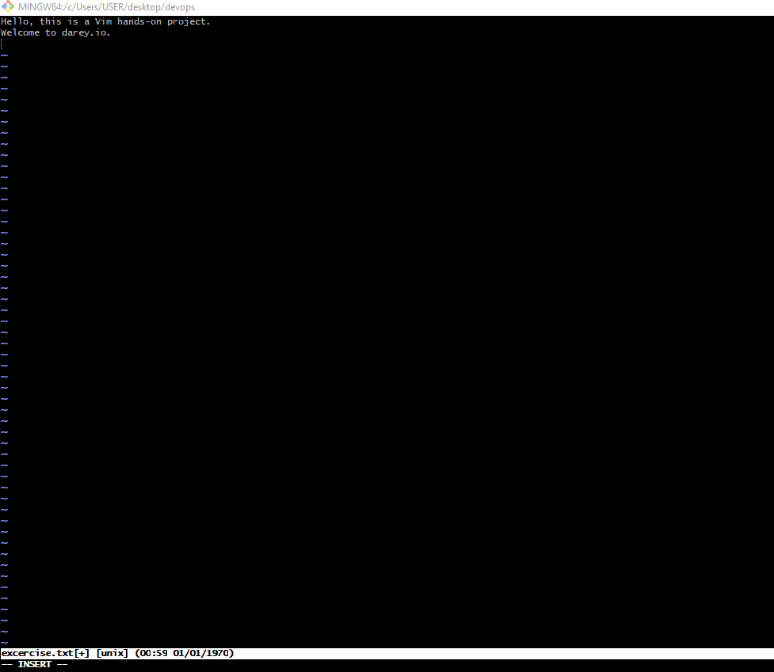
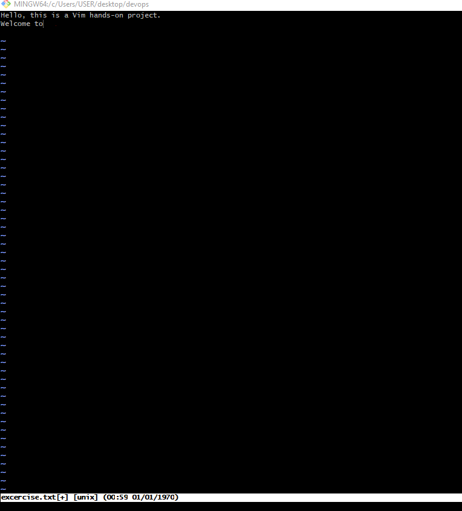
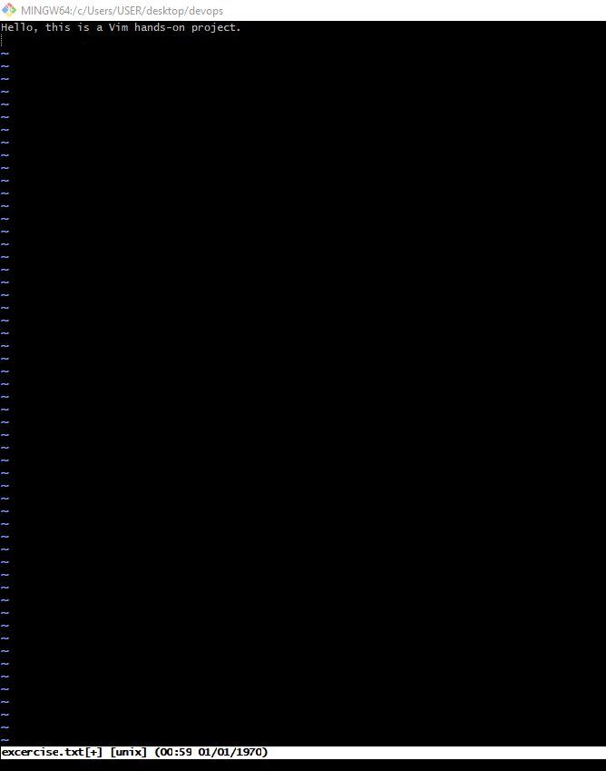
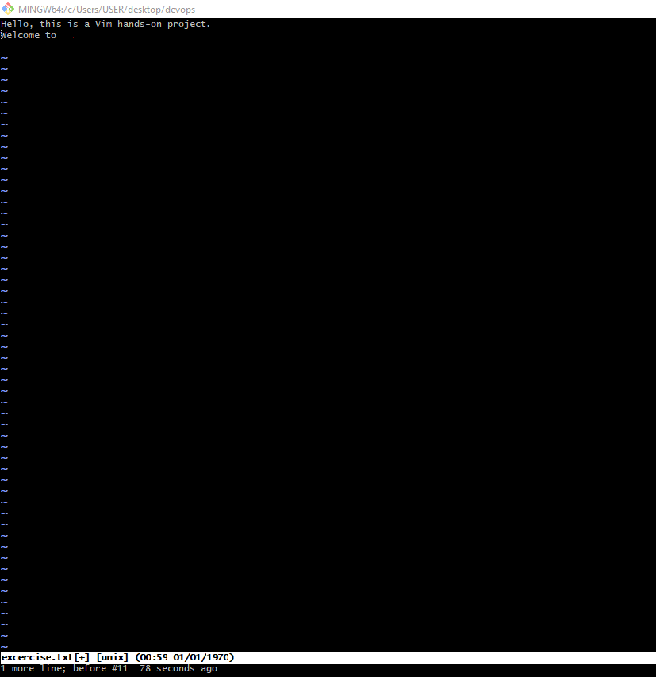
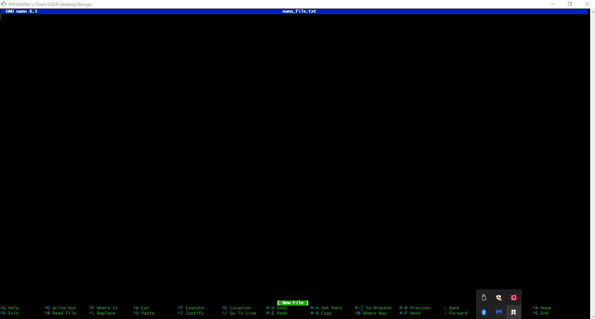
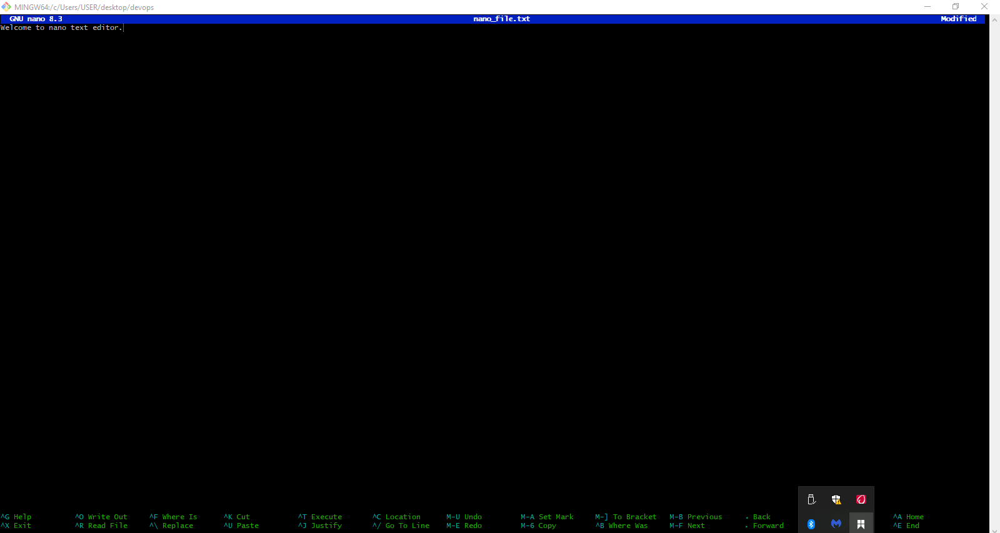
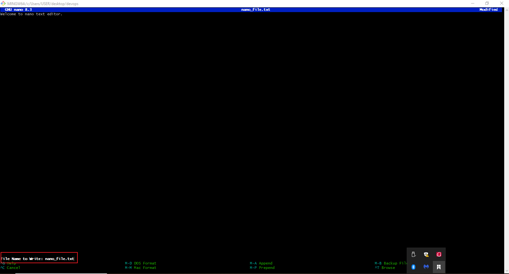

# Linux_Text_Editor

## INTRODUCTION

Text editors in Linux are programs used to create, edit, and manage text files, including scripts, configuration files, and code.

Two major text editors in Linux are:

1. vim
2. Nano

### 1. Vim:
vim (short for Vi IMproved) is an advanced command-line text editor designed for speed, efficiency, and extensive customization. It’s widely used by developers and system admins.

#### Basic Concepts of Vim

Vim has modes:

1. Normal mode – for navigating and editing.

2. Insert mode – for typing text.

3. Command mode – for saving, quitting, searching, etc

#### Basic Commands in Vim

1. To create/open a file: vim 'filename'

2. To write into the file: Press 'i' to enter Insert mode.

3. To exit Insert mode: Press 'esc'

4. To delete a character: Press 'x'

In the above screenshot, pressing 'x' deleted 'darey.io.'

5. To delete a line: Press 'dd'

In the screenshot above presssing 'dd' deleted the entire second line.

6. To undo a change: Press 'u'

In the screenshot above, pressing 'u' restored the deleted second line.

7. To save and exit: Press ':wq' + 'Enter'

8. To exit without saving: Press ':q!' + 'Enter'

### 2. Nano:
nano is a simple, command-line text editor that's easy to use, especially for beginners. It runs inside the terminal and doesn’t require learning complex commands like vim.

#### Basic Commands in Nano

1. To open/create a file: nano 'filename'

The screenshot above shows the nano interface.

2. Editing text in nano: nano has a simple interface, and you can start typing or editing immediately.

3. To save a file: Press 'ctrl' + 'o'

4. To exit nano: Press 'ctrl' + 'x'